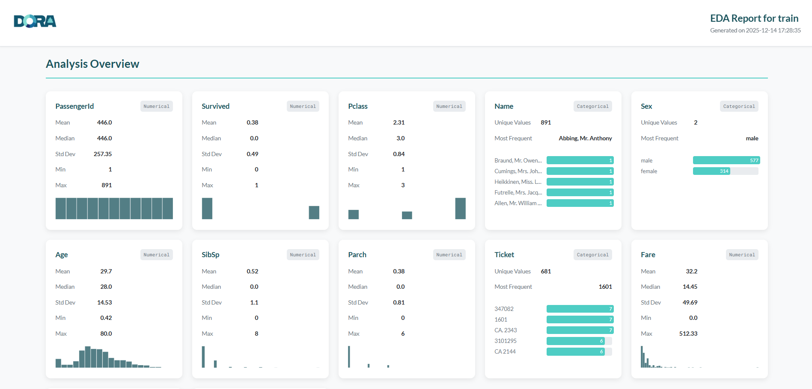
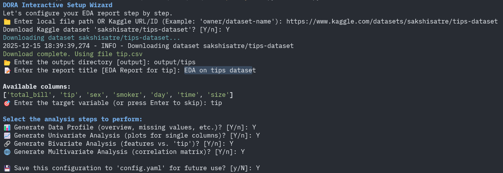

# Data Oriented Report Automator (DORA)

<p align="center">
    
</p>

<p align="center">
    
</p>

<em align="center">
An interactive command-line tool to automate Exploratory Data Analysis (EDA) and generate beautiful, insightful reports in seconds.
</em>

## What is DORA?

DORA is a tool that does the heavy lifting of data analysis for you. Instead of writing code to create charts and calculate statistics, you give DORA your data file, and it builds a comprehensive, beautiful HTML report automatically.

If you have used tools like [ydata-profiling](https://github.com/ydataai/ydata-profiling) and [sweetviz](https://pypi.org/project/sweetviz/), DORA lets you do more. It provides a way to process kaggle dataset as well without a lot of clutter.

## Get started in 2 minutes

1. Install DORA

Open your terminal and run the following command:

```bash
pip install dora-eda
```

2. Run DORA

Simply run the following command:
DORA supports the following file formats: `.csv`, `.xlsx`, `.json`, `.parquet`

```bash
dora
```
An interactive wizard will appear and ask a few simple questions:
- What is the path to your data file? (You can type a path like `data/raw/insurance` or even a Kaggle dataset URL like `https://www.kaggle.com/datasets/sakshisatre/tips-dataset`)
- Where should we save the report?
- What kind of analysis do you want?

Sit back for a few seconds, and DORA will generate your report.

**Example:**
<p align="center">
    
</p>

## Usage Examples

**The Easy Way (Interactive Wizard)**
Best for first-time users or quick checks.

```bash
dora
```

Just follow the prompts on the screen. DORA will handle the rest.

**The Automation Way**
If you run the same analysis often, you can save your configuration in a YAML file and run DORA with the `--config` flag.
```bash
dora --config config.yaml
```

## What Do I Get?
After DORA finishes, check the output folder you selected to find:
1. `eda_report.html`: The main report. double-click to open it in your browser.
2. `charts/`: A folder containing all the charts generated by DORA.

## Contribution
I love help from the community! If you are a developer and want to improve DORA, check out our [contribution guide](CONTRIBUTION.md) to get started with setting up the developer environment.

## License
DORA is licensed under the MIT License. See [LICENSE](LICENSE) for details.
